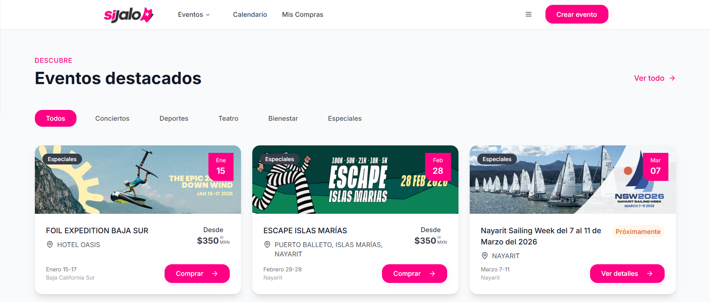
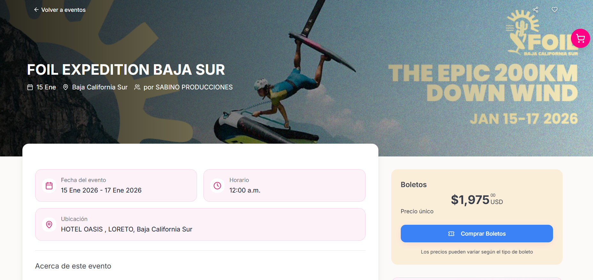
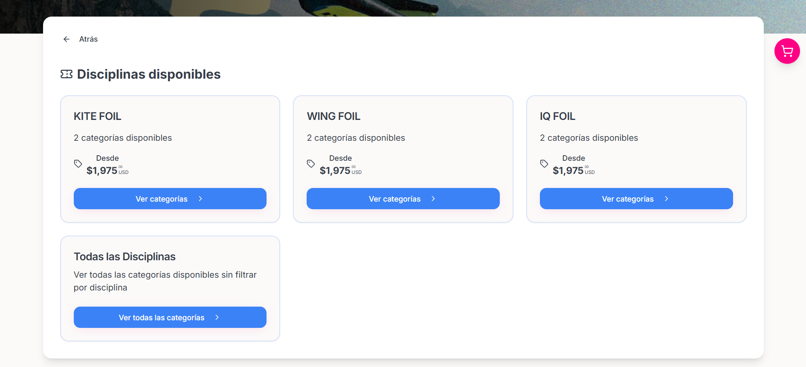
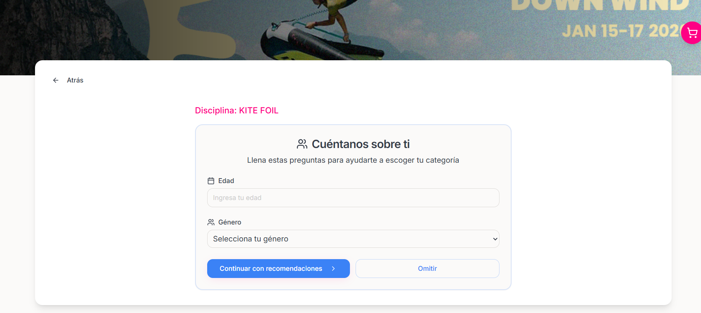
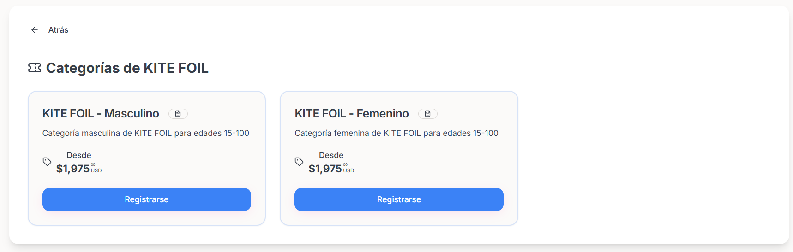
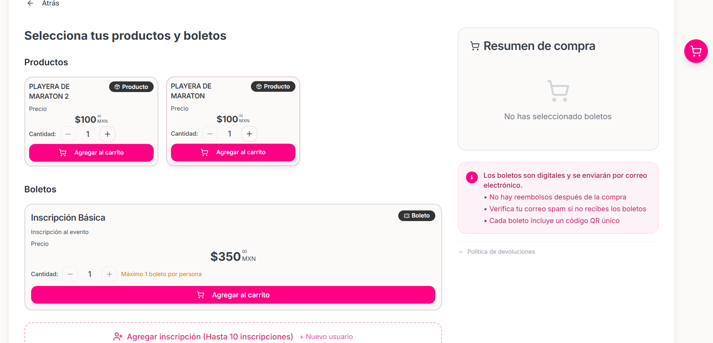
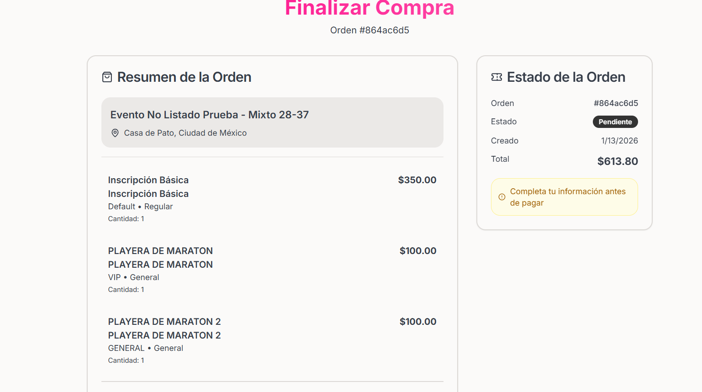
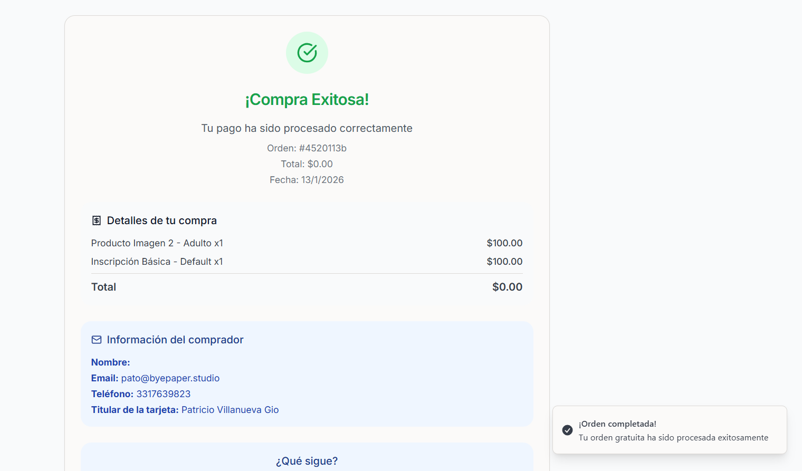

## Flujo de como inscribirte

### Paso 1: Explorar Eventos

**Busca tu evento ideal:**
- 🏃‍♂️ **Eventos deportivos:** Carreras, torneos, competencias
- 🎵 **Conciertos y festivales:** Música en vivo y entretenimiento
- 💼 **Conferencias:** Aprendizaje y networking
- 🎭 **Eventos culturales:** Teatro, arte, exposiciones

**¿Cómo encontrar eventos? Primero en la página principal realiza un scroll hacia abajo donde encontraras lo siguiente:**
- Eventos Destacados
- Explorar eventos (En este descubriras los eventos filtrados por categoría)

<Tip>
Si quieres buscar algun evento en particular puedes usar el buscador que se encuentra en la parte superior de la página principal
</Tip>

<Frame>
    
</Frame>

### Ejemplos de Eventos mas comunes con sus disciplinas:

#### **Eventos Individuales**
- 🏃‍♂️ **Carreras:** 5K, 10K, 21K, Maratón
- 🏊‍♀️ **Natación:** Diferentes distancias
- 🚴‍♂️ **Ciclismo:** Rutas y categorías
- 🎯 **Otros deportes:** Según el tipo de evento al que se quiera inscribir

#### **Eventos por Equipo**
- 👥 **Deportes en equipo:** Fútbol, basketball, etc.
- 👥 **Competencias grupales:** 2-10 integrantes

### Paso 2: Ver Detalles del Evento

**Una vez encontrado el evento al que deseas inscribirte revisa toda la información importante:**
- 📅 **Fecha y hora:** Cuándo y a qué hora
- 📍 **Ubicación:** Dónde se realizará
- 💰 **Precios:** Costos por categoría
- 👥 **Capacidad:** Lugares disponibles
- 📝 **Descripción:** ¿Qué incluye el evento?

<Frame>
    
</Frame>

<Warning>
    Revisa cuidadosamente la fecha y hora. Algunos eventos tienen límite de tiempo para inscribirse.
</Warning>

### Paso 3: Elegir la Disciplina en la cual quiere inscribirse
Cada Disciplina contara con categorías como por ejemplo: edad, género, nivel, etc.
<Frame>
    
</Frame>
<Note>
    Algunas disciplinas solo cuentan con una categoría dependiendo del tipo del evento al que se este inscribiendo
</Note>

### Paso 4: Al escoger una Disciplina tendras que completar un formulario para ayudarte a seleccionar la categoria correcta

<Frame>
    
</Frame>

**Selecciona tu categoría de participación:**
<Note>
    Si completaste el formulario correctamente se mostraran las categorías en las que puedes inscribirte, pero hiciste click sobre el botón de Omitir se te mostraran todas la categorías disponibles.
</Note>

<Frame>
    
</Frame>

<Tip>
    Algunas categorías tienen requisitos especiales (edad, género, nivel). Lee la descripción cuidadosamente.
</Tip>

### Paso 5: Completar Formulario de Registro

**Proporciona tu información personal:**

#### **Datos Personales**
-  **Nombre** 
-  **Apellido** 
-  **Fecha de nacimiento:** 
-  **Sexo:** Masculino, Femenino, Otro
-  **Nacionalidad:** 
-  **Talla de Camiseta:** -- Opcional

<Warning>
    Si la persona a inscribirse es menor de edad se requiere se requiere que un Padre o Tutor legal acompañe al menor al llenado del formulario
</Warning>

#### **Información de Contacto**
-  **Correo electrónico** 
-  **Teléfono** 

#### Información Medica
-  **Tipo de Sangre**
-  **Alergias**
-  **Condiciones Medicas**

#### Contacto de Emergencia
-  **Nombre Completo**
-  **Telefono**

<Warning>
    Asegúrate que todos tus datos sean correctos. No podrás editarlos después de pagar.
</Warning>

<Note>
    Si el evento es Individual pasar al paso 7
</Note>

### Paso 6: Inscripción por Equipo (Si Aplica)

**Si el evento es por equipo:**

#### **Paso 6.1: Crear el Equipo**
- 🏷️ **Nombre del equipo:** Creativo y representativo
- 👑 **Capitán:** Quién coordinará al equipo

#### **Paso 6.2: Completar Datos de Todos**
- 👥 **Formularios individuales:** Cada miembro completa su registro

<Warning>
    Falta Testear que mas falta NO PUDE SEGUIR CON EL FLUJO
</Warning>

### Paso 7: Agregar al Carrito

Cuando te hayas terminado de registrar te llevara a una página de detalles de la orden en el cual podras visualizar los productos y Boletos

<Frame>
    
</Frame>
En esta pantalla podras agregar los productos y tus boletos al carrito de compras
<Note>
    En algunos eventos solo se podra comprar 1 boleto por persona y si deseas inscribir a mas personas tienes que completar el formulario que se abrira al hacer click sobre el botón abajo de la sección de boletos "Agregar Inscripción (Hasta 10 inscripciones)"
</Note>

<Tip>
    Puedes inscribirte en múltiples categorías si el Evento lo permite, por lo que puedes inscribirte a mas de una categoria del mismo evento antes de pagar.
</Tip>

### Paso 8: Proceso de Pago

Al hacer click sobre continuar al pago al terminar de armar el carrito te llevara a la pantalla de pago en la cual podras consultar todos los productos y boletos que se agregaron al carrito también podras consultar:
- Precio total de la orden
- Cargos por Servicios
- Códigos de descuento
- Información del comprador -- Esta información aparecerá en tu recibo
- Direccion de Facturación -- Opcional
- Forma de Pago

<Frame>
    
</Frame>

<Warning>
    Tienes 15 minutos para completar el pago después de agregar al carrito, o tu inscripción se cancelará automáticamente.
</Warning>

### Paso 9: Confirmación y Tickets

**¡Felicidades! Ya estás inscrito:**

#### **Recibirás:**
- 📧 **Correo de confirmación:** Con todos los detalles
- 🎫 **Tickets digitales:** Código QR para el evento
- 📱 **Recordatorios:** Antes del evento
- 📋 **Instrucciones:** Qué llevar y qué esperar

<Frame>
    
</Frame>

