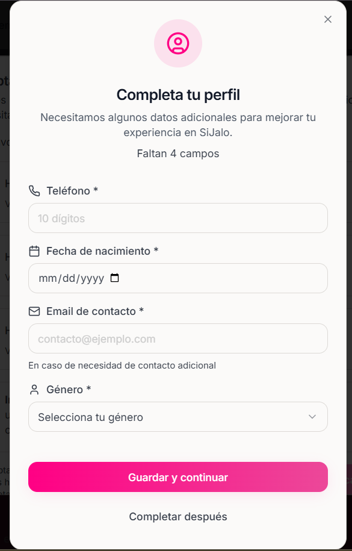

## Pasos para configurar tu cuenta

<Steps>
    <Step  title = "Crear tu cuenta como usuario">
        ### Hacer click en ingresar
       <Frame>
            
       </Frame>
        ---
        ### Dentro de la parte de Iniciar Sesión
        -  Dirigirte hasta abajo y hacer click en la opción "Registrarte aquí"
       ---

       ### Completar tus datos
       - Nombre Completo
       - Email 
       - Escribir tu contraseña
       - Confirmar tu contraseña
       - Aceptar los Términos y Condiciones, Política de Privacidad y la Política de Cookies
       ---
       ### Hacer click en Crear cuenta
       <Warning>
        Antes de Registrarse es necesario leer todos los Términos y condiciones, Política de Privacidad y la Política de Cookies
       </Warning>

       ### Revisar el la bandeja de entrada del correo electrónico para confirmar tu cuenta
       <Tip>
        Se recomienda revisar la bandeja de SPAM
       </Tip>
       - Una vez encontrado el correo hacer click en "Iniciar Sesión en SiJalo"
       
    
        </Step>
        <Step title = "Iniciar Sesión Como organizador">
     ### Hacer click en ingresar
       <Frame>
            
       </Frame>
    ### Dentro de la parte de Iniciar Sesión
        -  Completa los datos con los que te registraste
            - Nombre
            - Contraseña
            
        - Hacer click en Iniciar Sesión
        
    </Step>
    <Step title = "Completa tu perfil">
    ### proporciona los siguientes datos para completar tu perfil
    - Nombre
    - Apellido
    - Telefono
    - fehca de Nacimiento
    - Genero

    <Frame>
        
    </Frame>
    <Note>
        Completar el perfil al principio no es obligatorio pero es recomandado para tener una mejor experiencia al inscribirte a un evento
    </Note>
        
    </Step>

    <Step title = "Aceptar las politicas de SiJalo">
    <Warning>
        Antes de usar la plataforma es necesario leer y aceptar los términos y condiciones, política de privacidad y la política de cookies. De lo contrario no podra hacer uso de la plataforma.
    </Warning>
    Despues de haber leido y aceptado hacer click en los checkbox de cada politica, despues hacer click en Aceptar politicas
    </Step>
    
</Steps>

## Proximos Pasos
Ya que ya tienes tu cuenta creada puedes iniciar sesión y empezar a usar la plataforma para inscribirte a tus eventos favoritos. Si quieres saber que se puede hacer en la plataforma puedes dirigirte a la documentación de SiJalo en la seccion de Cliente.