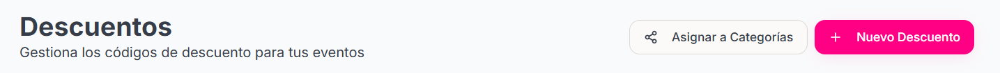

<Steps>
    <Step title="Hacer click sobre la sección Descuentos que se encuentra en el menú de la izquierda">
        
    </Step>

    <Step title="Hacer click sobre el botón 'Nuevo Descuento' ">

    <Frame>
        </img>
    </Frame>
        
    </Step>

    <Step title="Completar los Datos solicitados de Crear Nuevo Descuento">

    - Nombre del Descuento
    - Código
    - Tipo de Descuento
    - Porcentaje
    - Válido desde -- Opcional
    - Válido hasta
    - Máximo de usos -- Opcional
    - Límite por usuario -- Opcional
    - En caso de que el descuento sea para un usuario específico proporcionar el Email del usuario
    - Razón del descuento -- Opcional
        
    </Step>

</Steps>

### Una vez creado el evento ¿Cómo lo asignas a una categoría?

<Steps>
    <Step title="Hacer click sobre el botón Asignar a Categorías">
        <Frame>
            </img>
        </Frame>
    </Step>

    <Step title="Asignar Descuentos a Categorías">

    - Seleccionar si quieres asignar el descuento para todas tus categorías o solo para categorías especificas, en caso de ser categorías especificas seleccionar esas categorías
    - Seleccionar el Evento al cual le vas a asignar el descuento
        
    </Step>

    <Step title="Hacer click sobre Asignar el Descuento">
    <Frame>
            </img>
        </Frame>
    <Warning>
        Antes de Asignar el Descuento verificar que todos los datos del descuento sean correctos.
    </Warning>

    </Step>
</Steps>