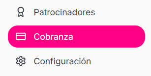

<Steps>
    <Step title="Hacer Click en la sección 'Cobranza' que se encuentra en el menu de la izquierda">

    <Frame>
        
    </Frame>
        
    </Step>
    <Step title="Hacer click en el botón 'Agregar Cuenta Bancaria'">
    <Frame>
        
    </Frame>
        
    </Step>

    <Step title="Completar los datos solicitados">

        - Banco
        - Nombre del titular
        - CLABE interbancaria
        - Número de Cuenta -- opcional

        <Warning>
           Verifique que los datos proporcionados de la cuenta bancaria sean correctos ya que no se podrán modificar, mostrar y/o eliminar. A menos que contacte al equipo de SiJalo
        </Warning>
    </Step>
</Steps>

