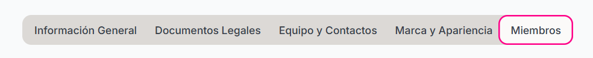

### ¿Cómo Agrego Miembros a mi Organización?

<Steps>
    <Step title="Hacer click sobre la sección 'Configuración' en el mení de la izquierda">
        
    </Step>

    <Step title="Hacer click sobre 'Miembros' ">
        <Frame>
        </img>
    </Frame>
    </Step>

    <Step title="Hacer click sobre el botón 'Invitar Miembro' ">
        <Frame>
        </img>
    </Frame>
    </Step>

    <Step title ="Proporcionar los datos solicitados">
    - Correo Electrónico
    - Rol de la persona invitada

    <Note>
        Existen 3 Roles para los Miembros los cuales son:
        - Administrador : usar libremente la plataforma 
        - Miembro : puede editar casi todo pero no puede dar acceso a Dashboard de finanzas
        - Visualizador : solo puede visualizar los eventos y los registros
    </Note> 
        

    <Tip>
        Una vez mandada la invitación informar a la persona que revise su correo en la sección de SPAM para aceptar la invitación
    </Tip>
    </Step>
</Steps>