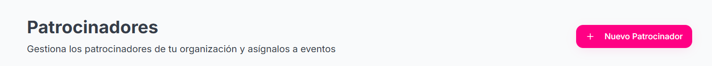
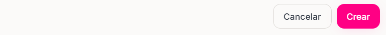
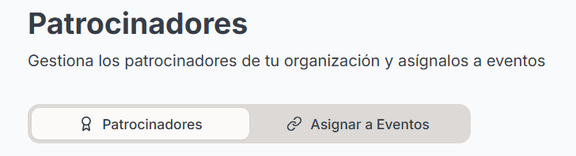
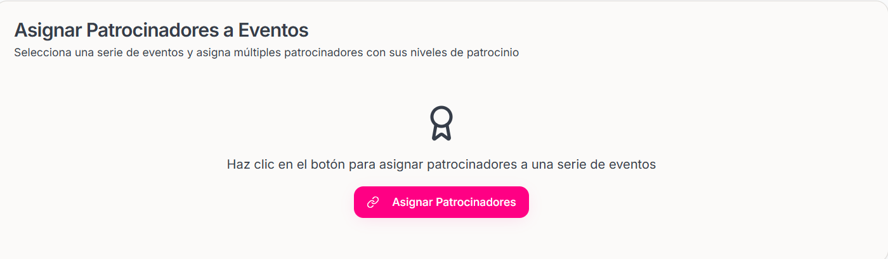
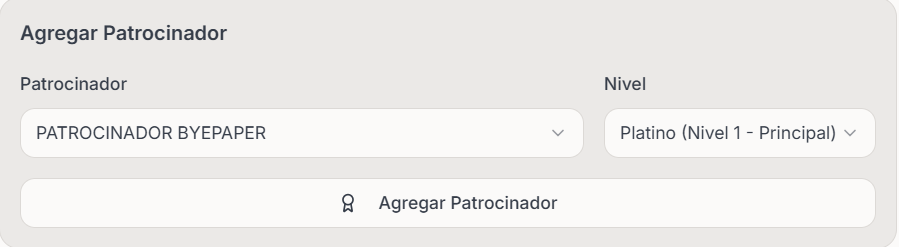

### ¿Cómo se crea un nuevo patrocinador?

<Steps>
    <Step title="Hacer click sobre la sección 'Patrocinadores' que se encuentra en el menu izquierdo de la pantalla">
        
    </Step>

    <Step title="Hacer click en 'Nuevo Patrocinador' ">
        <Frame>
            
        </Frame>
    </Step>

    <Step title="Proporcionar los Datos del patrocinador">
        - Logo -- Opcional
        - Nombre
        - Eslogan -- Opcional
        - SitioWeb -- Opcional
        - Descripción -- Opcional
        - Email de contacto -- Opcional
        - Teléfono de Contacto -- Opcional
       
    </Step>

    <Step title="Hacer click en el boton Crear">

    <Frame>
            
    </Frame>
            <Warning>
                En cuanto hagas click en el botón de crear aparte de crearte el patrocinador te va a dirigir de forma automática a la ventana de Asignar Patrocinador.
            </Warning>
    </Step>

</Steps>

### ¿Cómo puedes asignar un patrocinador a un Evento?

<Steps>
    <Step title="Una vez Creado el patrocinador hacer click sobre el botón Asignar a Eventos">

    <Frame>
            
    </Frame>
        
    </Step>

    <Step title="Hacer click sobre el botón de Asignar Patrocinadores">

    <Frame>
            
    </Frame>
        
    </Step>

    <Step title="Completar los datos de Asignación de Patrocinador">

    - Seleccionar el evento en el cual vamos a asignar al patrocinador
    - Seleccionar el patrocinador previamente creado y asignarle un Nivel de patrocinio.
    
    <Accordion
        title="Niveles de Patrocinio">

        - Platino :
        - Oro :
        - Plata : 
        - Bronce :
        
    </Accordion>

  
        
    </Step>

    <Step title="Hacer click sobre el botón 'Agregar Patrocinador'">

        <Frame>
            
        </Frame>

        <Note>
            En esa misma ventana de Asignar Patrocinador podras consultar los Patrocinadores Asignados 
        </Note>

    </Step>

    <Step title="Hacer click sobre el botón Guardar Asignaciones">

        <Frame>
            
        </Frame>

    </Step>

</Steps>