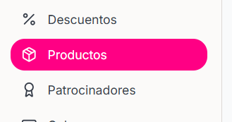
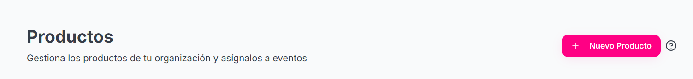
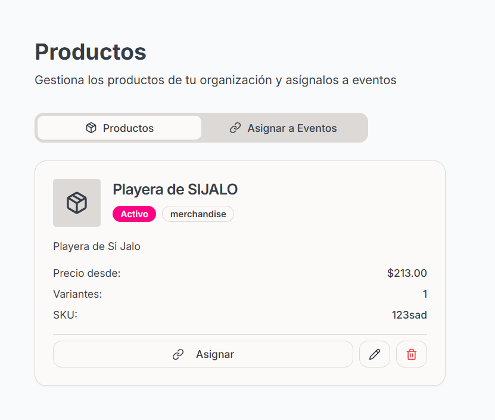
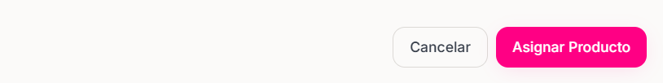

<Steps>
    <Step title="Hacer click en la sección 'Productos' en el menu de la izquierda">

    <Frame>
        
    </Frame>
        
    </Step>
    <Step title="Hacer click en 'Nuevo Producto' ">

    <Frame>
        
    </Frame>
        
    </Step>

    <Step title="Completar datos solicitados">
        - Nombre
        - Tipo
        - Descripción
        - Imagén del producto
        - SKU
        - Categoría Fiscal
        - Visibilidad
        - Minimo por orden
        - Limite por Usuario
        - Producto Activo
        - Rastrear en inventario
        
    </Step>

    <Step title="En caso de que el producto sea único:">
        <Note>
            En caso de que el producto sea único haga click sobre el boton "Crear" en caso de tener variantes siga con los siguientes pasos.
        </Note>
        
    </Step>

     <Step title="Hacer click sobre el botón 'Variantes y Precios'">
        
    </Step>

    <Step title="Hacer click sobre el botón 'Agregar Variante'">

      <Frame>
        
      </Frame>
        
    </Step>

    <Step title="Completar los datos de la o las variantes">
    - Nombre
    - SKU
    #### Si haces click en el botón "Agregar Precio" se desplegaran las siguientes opciones sobre la variante:

    - Precio -- Precio sobre la variante
    - Nombre para el nivel de precio -- ej. Descuento, Edicion Limitada, etc
    - Moneda -- ej. MXN, USD, EUR.
    - Limite -- Cuantas unidades existen sobre esta variante del producto
    - Precio Early Bird -- precio especial con descuento que estará disponible por tiempo limitado o para una cantidad limitada de compradores.

    #### Si haces click en Early Bird se desplegara un menu con los siguientes campos:

    - Precio de Early Bird
    - Fecha de Inicio
    - Límite Early Bird
    - Fecha de Fin

    <Note>
        El precio early bird se aplicará cuando se cumplan las condiciones de fecha Y/O cantidad límite. Si no especificas fechas, solo se aplicará el límite de cantidad. Si no especificas límite de cantidad, solo se aplicará el rango de fechas.
    </Note>

    </Step>

    <Step title="Crear el producto">

    <Note>
        Una vez configurado la información Basica y/o Variantes y Precios. Verifica que los datos proporcionados sean correctos.
    </Note>
        #### Hacer click sobre el botón "Crear" para agregar el producto a los productos
    <Frame>
        
    </Frame>

    </Step>

</Steps>
#### ¿Cómo asignar productos a Eventos?
    <Steps>
        <Step title="Una vez creado el producto hacer click sobre el botón 'Asignar' ">

        <Frame>
            
        </Frame>
            
        </Step>
        <Step title="Escoger el tipo de asignacion del producto a las categorias">
        - Asignar a todas las categorias de una serie
        - Asignar a categorias especificas/

        ##### Seleccionar el evento en el cual asignaran los productos en "Serie de eventos"

        <Note>
            Al escoger la opción de Asignar a categorias especificas se te mostrara un apartado de Eventos en el cual podras seleccionar en cual categoría se podré asignar el producto. Para que el apartado se muestre también tendra que tener seleccionado el evento en "Serie de eventos"
        </Note>
            
        </Step>

        <Step title="Hacer click en el botón Asignar Producto">

        <Frame>
            
        </Frame>

        <Warning>
            Verificar en caso de seleccionar categorias especificas que las categorias seleccionadas sean las correctas antes de asignar el producto
        </Warning>
        
        </Step>
    </Steps>

    