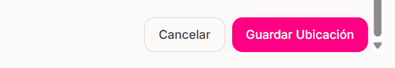

<Steps>
    <Step title="hacer click en el apartado de Ubicaciones que se encuentra hasta abajo del menú de la izquierda">
        
    </Step>

    <Step title="Hacer click en el botón 'Nueva Ubicación' ">
        <Frame>
            </img>
        </Frame>
        
    </Step>

     <Step title="Crear Nueva Ubicación">
        ## Detalles de la ubicación del evento
        - Nombre de la ubicación
        - Calle y número exterior
        - Número interior, piso, colonia, etc.
        - Ciudad
        - Estado
        - Código Postal
        - País
        - Capacidad Máxima participantes
        - Tipo de ubicación
        - URL de la ubicación -- enlace a Google Maps o Waze
        - Imagenes de referencia del lugar
        
    </Step>

    <Step title="Hacer click en el botón Guardar Ubicación despúes de proporcionar los datos necesarios ya mencionados en el paso 3">
        <Frame>
            </img>
        </Frame>

    </Step>

</Steps>