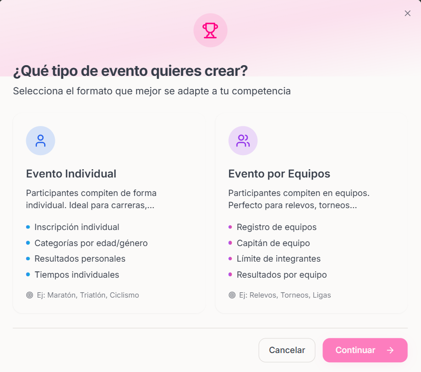
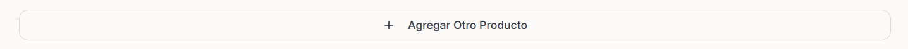
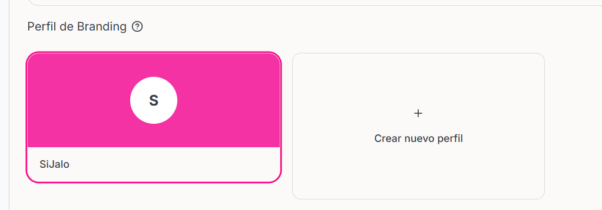
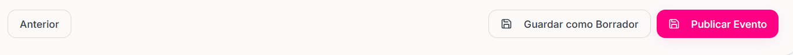

### ¿Cómo crear un evento?
<Steps>
    <Step title="Ubicarte en la sección de Eventos">
        
    </Step>
    <Step title="Hacer click en botón Crear Evento">
    <Frame>
        </img>
    </Frame>
        
    </Step>

    <Step title = "Seleccionar si el evento a crear es Individual o en Equipos">
        <Frame>
            </img>
        </Frame>
         
    </Step>

    <Step title="¿Qué datos necesitamos para cada tipo de Evento?">

    ### En caso de haber seleccionado 'Evento por Equipo' proporcione los siguientes datos en la secciones correspondientes

    <AccordionGroup>
        <Accordion
            title="Información General">
            ## Datos requeridos
            - Nombre del Evento: El título oficial que aparecerá en la cartelera y boletos.
            - Fecha de Inicio del Evento: Cuándo deben presentarse los asistentes para el comienzo de la actividad.
            - Hora de Inicio: Solo es necesaria si tu evento dura más de un día (ej. un festival de fin de semana).
            - Fecha de Término del Evento -- Dejar en blanco si solo dura un día
            - Hora de Finalización : Indica a qué hora concluyen las actividades para logística del usuario.
            - Tipo de Evento: Define la categoría (deportivo, musical, cultural) para ayudar en los filtros de búsqueda.
            - Sitio Web del Evento: Enlace a tu página oficial o redes sociales para dar más contexto al usuario. --Opcional 
            - Visibilidad del evento: Público: Aparece en el buscador de SiJalo. Privado: Solo accesible por el panel de organizador.
            - Ubicación del evento: El lugar físico donde se llevará a cabo. Recuerda que debe estar previamente registrada en tu catálogo de ubicaciones.
            <Tip>
                Si aún no cuentas con ubicaciones registradas puedes revisar el contenido de "Agregar Ubicaciones"
            </Tip>

            Una vez proporcionados los datos favor de hacer click en el botón "Siguiente"

            
        </Accordion>

        <Accordion
            title="Configuración de Equipos">

            ### Define las reglas y límites para los equipos participantes

            - Tamaño Mínimo de Equipo
            - Tamaño Máximo de Equipo
            
            ### Opciones de Equipo

            - Permitir que los equipos esten incompletos: Sirve para que los equipos puedan participar sin alcanzar el mínimo de integrantes.
            - Capitán requerido: Sirve para designar a un capitán responsable
            - Permitir cambios de equipo: Los participantes del equipo podrán cambiar de equipo después del reigstro

        </Accordion>

        <Accordion
            title="Categorías">
            ### Aquí podras crear las diferentes categorías o divisiones para tu evento.
            
             <Steps>
                <Step title="Agregar Nueva Categoría">

                 ### Para Agregar una Nueva Categoría necesitar proporcionar los siguientes datos.   
                - Nombre de la Categoría
                - Descripción
                - Tipo de Equipo: Mixto, Masculino, Femenino u otro.
                - Mínimo de Integrantes
                - Máximo de Integrantes
                    
                </Step>
                <Step title="Hacer click sobre el botón de Agregar Categoría">

                    Esto Creara una nueva categoría con los dato proporcionados y podras verla en la sección de Categorías Creadas.
                    
                    <Frame>
                        </img>
                    </Frame>

                    

                </Step>
             </Steps>

            
        </Accordion>

         <Accordion
            title="Productos">

            ### Aquí podras definir los precios y tipos de inscripciones para tu evento 

            <Steps>
                <Step title= "Datos necesarios por producto">
                    - Nombre del producto
                    - Precio
                    - Moneda : MXN, USD
                    - Descripción del producto
                    - Precio por persona: si esta opción esta desactivada el Precio será para por equipo completo
                    - inventario
                </Step>
                <Step title="Si quieres agregar mas productos puedes hacer click sobre el botón Agregar Otro Producto">
                    

                    <Frame>
                        </img>
                    </Frame>

                </Step>
            </Steps>
            
            
            
        </Accordion>

        <Accordion
            title="Inscripciones">

            ### Datos solicitados para las Inscripciones

            - Fecha de Apertura de Inscripciones
            - Fecha de Cierre de Inscripciones
            - Máximo de Equipos por Categoría -- Dejar vacío para no tener Límite 
            - Máximo Total de Equipos -- Dejar vacío para no tener Límite

            ### Al finalizar hacer click en el botón "Siguiente"

          
          
          <Frame>  </Frame>

            <Warning>
                Verificar la Capacidad Máxima General permitida por el evento si este mismo cuenta con un Límite antes de darle click al botón "Siguiente"
            </Warning>

        </Accordion>

        <Accordion
            title="Branding">

            ### Branding y Descripción

            <Tip>
                Si no cuentas con un perfil que te agrade te recomendamos crear uno nuevo
            </Tip>

            ### Crear un nuevo Perfil
            <Steps>
                <Step title="Hacer click en el cuadro de 'Crear nuevo perfil'">
                <Frame>
                    </img>
                </Frame>
                    
                </Step>
                <Step title="Completar los datos del perfil de tu marca">
                - Nombre de la marca
                - Color primario de la marca
                - Color Secundario de la marca
                - URL del logo
                - Tipo de logo
                - URL del Banner
                - Tipo de Banner
                    
                </Step>

                <Step title="Hacer click en el botón 'Crear Perfil'">
                <Frame>
                    </img>
                </Frame>

                <Warning>
                    Al crear un nuevo perfil se reemplazará el perfil ya existente
                </Warning>
                    
                </Step>

            </Steps>
            
            ### Descripción Detallada  del evento
            - Escribe una descripción completa de tu evento

            ### Una vez proporcionado los datos hacer click en el botón "Siguiente"
                    

                    <Frame>
                        </img>
                    </Frame>

                    <Note>
                        Antes de hacer click verifica que toda la información proporcionada sea correcta.
                    </Note>

        </Accordion>

        <Accordion
            title="Vista Previa">
            
            ### Datos a Verificar

            - Nombre del Evento
            - Fecha de finalización
            - Ubicación
            - Tipo de Evento
            - Configuración de equipos
            - Categorías
            - Productos

            <Warning>
                Es importante que en esta parte se verifique que toda la información es correcta ya que una vez creada no podrá editar algunas partes
            </Warning>

            ##### Una vez verificados los datos del evento puede tanto guardarlo como borrador o directamente publicar el Evento

            <Frame>
                
            </Frame>

            <Note>
                Solo podrá publicar un Evento si ya firmó el CONTRATO DE LICENCIAMIENTO Y PRESTACIÓN DE SERVICIOS TECNOLÓGICOS.
            </Note>

        </Accordion>

    </AccordionGroup>
        

    ### En caso de haber seleccionado 'Evento Individual' proporcione los siguientes datos en la secciones correspondientes"

        <AccordionGroup>
            <Accordion
                title="Información General">
                ## Datos requeridos
                - Nombre del Evento: El título oficial que aparecerá en la cartelera y boletos.
                - Fecha de Inicio del Evento: Cuándo deben presentarse los asistentes para el comienzo de la actividad.
                - Hora de Inicio: Solo es necesaria si tu evento dura más de un día (ej. un festival de fin de semana).
                - Fecha de Término del Evento -- Dejar en blanco si solo dura un día
                - Hora de Finalización : Indica a qué hora concluyen las actividades para logística del usuario.
                - Tipo de Evento: Define la categoría (deportivo, musical, cultural) para ayudar en los filtros de búsqueda.
                - Sitio Web del Evento: Enlace a tu página oficial o redes sociales para dar más contexto al usuario. --Opcional 
                - Visibilidad del evento: Público: Aparece en el buscador de SiJalo. Privado: Solo accesible por el panel de organizador.
                - Ubicación del evento: El lugar físico donde se llevará a cabo. Recuerda que debe estar previamente registrada en tu catálogo de ubicaciones.
                <Tip>
                    Si aún no cuentas con ubicaciones registradas puedes revisar el contenido de "Agregar Ubicaciones"
                </Tip>

                Una vez proporcionados los datos favor de hacer click en el botón "Siguiente"

                
            </Accordion>

            <Accordion
                title="Disciplinas y Categorías">
                ### Dentro de nuestros eventos se permite la creación de Disciplinas y Categorías
                ---
                #### Categorías

                Cada evento cuenta con categorías basadas en edad, género y otras características. Puedes crear categorías manualmente o usar nuestro generador automático.
                #### Disciplinas
                Cada evento cuenta con la posibilidad de tener una o varias disciplinas para facilitar la organización del Evento.
                
            </Accordion>

            <Accordion
                title= "Número de Competidores">
                ### Número de Competidores

                Aqui podras Asignar números únicos a cada participante con una númeración automática. Esta función es opcional aunque muy útil para la organización de Eventos Deportivos.

                ### Métodos de Numeración

                Una vez activada la opción de numeración automatica podrás escoger entre dos métodos de numeración.
                    <Tip>
                        ¿Cómo funciona? Los números se asignarán automáticamente cuando un participante complete su inscripción. Podrás ver y modificar los números asignados en la sección de gestión de asistentes.
                    </Tip>
                
                <AccordionGroup>
                    <Accordion
                        title="Secuencial">
                        ### Secuencial Simple
                        Todos los participantes reciben un número consecutivo sin importar su categoría.
                        <Note>
                            Podrás seleccionar el número desde el cual comenzará la numeración
                        </Note>
                        
                    </Accordion>
                    <Accordion
                        title="Por Categoría">
                        ### Por Categoría
                        Cada categoría tiene su propio prefijo y secuencia numérica independiente.

                        <Note>
                            Podrás seleccionar el número desde el cual comenzará la numeración
                        </Note>                        
                    </Accordion>

                </AccordionGroup>

            
                
            </Accordion>

            <Accordion
                title="Configuración de Hits">
                ### Configuración de Hits
                <Tip>
                    Los hits permiten dividir tu competencia en múltiples rondas cuando hay limitaciones de capacidad. Ideal para carreras, competencias deportivas y eventos con muchos participantes.
                </Tip>

                ### Configuración Básica de Hits

                - Número Total de Hits
                - Participantes por Hit
                - Patrón de Nombres (Usa {number} donde quieras que aparezca el número del hit)

                ### Configuración de Ubicaciones
                puedes seleccionar si cada Hit tendra su propia ubicación o si todos los hits comparten la misma ubicación.
                ### Configuración de Tiempos
                Aqui podras confirurar la duración aproximada por hit en minutos y también el Descanso aproximado entre Hits en minutos.

                ### Estrategia de Distribución
                Aqui podras configurar como se arman los Hits
                - Secuencial (Por orden de registro)
                - Aleatorio
                - Por Ranking/Semilla
                - Por Categoría

                También podras habilitar que los Hits sean especificos por categoría. y que se generen hits de forma automáticamente al registrarse los participantes en el Evento.

                ### Vista Previa
                Aquí podras visualizar todas las configuraciónes que se realizaron de los Hits para que puedas verificar que todo esté correcto.
                Podras Verificar los siguientes Datos:
                - Hit
                - Cantidad de Participantes por hit
                - Duración aproximada por hit
                - Ubicación
                

                
            </Accordion>
            
            <Accordion
                title="Configuración de Productos">
                ### Configuración de Productos
                En cada evento puedes vender productos como:
                - Boletos ( ej. Básico, VIP, etc)
                - Mercancía ( Playeras, Sudaderas, etc)
                - Servicio ( Transporte, Comida, etc)
                - Otros

                ### ¿Cómo crear un producto?

                Existen 2 maneras de crear un producto la primera es directamente en la creación del evento en la parte 3 "Productos" y la segunda es mediante la sección "Productos" que se encuentra en el menú.

                <Note>
                    Si quieres aprender cómo crear un producto desde la sección "Productos" Dirígete a "Agregar Productos" en la documentación de SiJalo
                </Note>

                <Steps>
                    <Step title="Hacer Click sobre 'Añadir Producto'. ">

                    <Frame>
                        </img>
                    </Frame>
                        
                    </Step>
                    <Step title="Proporcionar los datos del producto">
                    - Nombre del Producto
                    - descripción del producto
                    - Tipo de Producto
                    - Visibilidad
                    - Precio 
                    - Moneda
                    - Inventario
                    - Límite por Usuario
                    - Mínimo por Orden
                    - Máximo por Orden
                    - Producto obligatorio
                    - Producto Activo
                    - Seguimiento del inventario
                        
                    </Step>

                    <Step title="Hacer Click sobre 'Añadir Producto'. ">

                    <Frame>
                        </img>
                    </Frame>
                        
                    </Step>
                </Steps>
        
                ### Vincular Productos a categorías
                Una vez creado el producto puedes escoger que personas son elegibles para poder adquirir el producto creado.

                <Frame>
                        </img>
                    </Frame>
                
                
            </Accordion>

            <Accordion
                title="Inscripciones">

                ### Datos solicitados para las Inscripciones

                - Fecha de Apertura de Registro
                - Fecha de Cierre de Registro
                - Límite de Inscripciones por Persona 
                - Capacidad Máxima General
                - Si el Evento que creaste contiene categorias seleccionar la capacidad máxima por cada categoría creada

                ### Al finalizar hacer click en el botón "Siguiente"

            
            
            <Frame>  </Frame>

                <Warning>
                    Verificar la Capacidad Máxima General permitida por el evento si este mismo cuenta con un Límite antes de darle click al botón "Siguiente"
                </Warning>

            </Accordion>

            <Accordion
                title="Branding y Descripción">

                ### Datos solicitados
                - Descripción detallada del evento
                - Perfil de Branding

                ### Perfil de Branding

                <Tip>
                    Si no cuentas con un perfil que te agrade te recomendamos crear uno nuevo
                </Tip>

                ### Crear un Perfil de Marca 
                <Steps>
                    <Step title="Hacer click en el cuadro de 'Crear nuevo perfil'">
                    <Frame>
                        </img>
                    </Frame>
                        
                    </Step>
                    <Step title="Completar los datos del perfil de tu marca">
                    - Nombre de la marca
                    - Color primario de la marca
                    - Color Secundario de la marca
                    - URL del logo
                    - Tipo de logo
                    - URL del Banner
                    - Tipo de Banner
                        
                    </Step>

                    <Step title="Hacer click en el botón 'Crear Perfil'">
                    <Frame>
                        </img>
                    </Frame>

                    <Warning>
                        Al crear un nuevo perfil se reemplazará el perfil ya existente
                    </Warning>
                        ### Una vez creado hacer click en el botón "Siguiente"
                        

                        <Frame>
                            </img>
                        </Frame>

                        <Note>
                            Antes de hacer click verifica que toda la información proporcionada sea correcta.
                        </Note>
                    </Step>

                </Steps>
                

            </Accordion>

            <Accordion
                title="Vista Previa">
                
                ### Datos a Verificar

                - Nombre del Evento
                - Organizador
                - Fechas
                - Horarios
                - Ubicación
                - Tipo de Evento
                - Descripción
                - Inscripciones
                - Productos

                <Warning>
                    Es importante que en esta parte se verifique que toda la información es correcta ya que una vez creada no podrá editar algunas partes
                </Warning>

                ##### Una vez verificados los datos del evento puede tanto guardarlo como borrador o directamente publicar el Evento

                <Frame>
                    
                </Frame>

                <Note>
                    Solo podrá publicar un Evento si ya firmó el CONTRATO DE LICENCIAMIENTO Y PRESTACIÓN DE SERVICIOS TECNOLÓGICOS.
                </Note>

            </Accordion>

        </AccordionGroup>
</Step>
            

</Steps>
