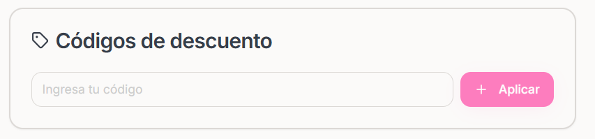
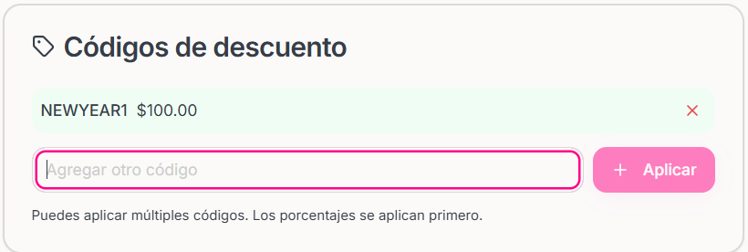

### ¿Cómo se consultan los descuentos?

<Steps>
    <Step title="Hacer click sobre la sección Descuentos que se encuentra en el menú izquierdo de la pantalla">
        
    </Step>

    <Step title="Antes de poder consultar los descuentos, tienes que contar previamente con descuentos en las categorías.">
    <Note>
        Si quieres saber cómo Agregar un Descuento puedes ir a la documentación de SiJalo Organizador en "Agregar Descuentos"
    </Note>
    </Step>

    <Step title="Vas a hacer click sobre el botón 'Por Categoría'">

    <Frame>
           
    </Frame>
    </Step>

    <Step title="Completar los datos para consultar los descuentos aplicados dentro del evento">

    <Frame>
           
    </Frame>
    </Step>

</Steps>

### ¿Cómo consultar todos los descuentos que has creado?

<Steps>
    <Step title="Hacer click sobre 'Descuentos Generales'">

    <Frame>
           
    </Frame>
        
    </Step>
    <Step title="Aquí podrás consultar todos los descuentos creados">
    
    <Frame>
           
    </Frame>

    </Step>
</Steps>
 
## ¿Cómo funciona en el checkout?
Una vez que el usuario ingresa el código de descuento, se le mostrará el precio final con el descuento aplicado. 

<Note>
    Siempre teniendo en cuente que primero se aplicara el procentaje y despues el descuento fijo.
</Note>

<Warning>
    Si el total es menor a 0, se mostrará 0.
</Warning>
## Paso a paso del checkout con descuento
<Steps>
    <Step title="Verificar los productos que se van a comprar">
    
    </Step>
    <Step title="Ingresar el código o codigós de descuento en la sección de Códigos de descuento">
    
<Frame>
    
</Frame>
<Note>
    Si el código es válido, se mostrará el precio final con el descuento aplicado. y Aparte una etiqueta que sera visible arriba de insertar el codigo de descuento.
</Note>
<Frame>
    
</Frame>
    </Step>
    <Step title="Una vez que el usuario ingresa el código de descuento, se le mostrará el precio final con el descuento aplicado.">
    <Frame>
        
    </Frame>
    </Step>
</Steps>