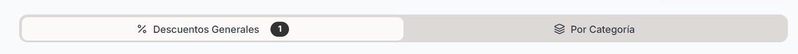
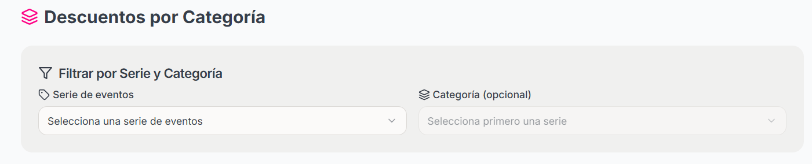

### ¿Cómo se consultan los descuentos?

<Steps>
    <Step title="hacer click sobre la seccion Descuentos que se encuentra en el menu izquierdo de la pantalla">
        
    </Step>

    <Step title="Antes de poder consultar los descuentos, tienes que contar previamente con descuentos en las categorias.">
    <Note>
        Si quieres saber como Agregar un Descuento puedes ir a la documentación de SiJalo Organizador en "Agregar Descuentos"
    </Note>
    </Step>

    <Step title="Vas a hacer click sobre el botón 'Por Categoría'">

    <Frame>
           
    </Frame>
    </Step>

    <Step title="Completar los datos para consultar los descuentos aplicados dentro del evento">

    <Frame>
           
    </Frame>
    </Step>

</Steps>

### ¿Cómo consultar todos los descuentos que has creado?

<Steps>
    <Step title="Hacer click sobre 'Descuentos Generales'">

    <Frame>
           
    </Frame>
        
    </Step>
    <Step title="Aquí podras consultar todos los descuentos creados">
    
    <Frame>
           
    </Frame>

    </Step>
</Steps>
 