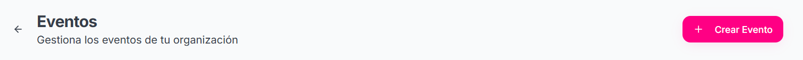

#### Creación de eventos
En la parte superior derecha se encuentra el botón de Crear Evento que sirve para Crear los eventos de la organización.

<Frame>
        </img>
    </Frame>

<Tip>
    Si no sabes como crear un Evento en la documentación de SiJalo Organizador en el documento "Creación de Eventos" explica el proceso paso a paso para crear y publicar los eventos.
</Tip>

#### Estadísticas de eventos

En esta sección podras filtrar las Estadísticas de los eventos en:
- Ultimos 7 días
- Ultimos 30 días
- Este mes
- Todo el tiempo

Las Estadísticas que puedes consultar son:
- Total de Eventos
- Boletos Vendidos
- Ingresos totales

#### Sección de consulta de eventos

En esta seccion podras consultar y/o filtrar los eventos que tu organización haya creado con anterioridad estos se pueden filtrar por: 

- Estados (Borrador, Publicado, Archivado, Todos los estados)
- Fechas
- Nombre del evento (mediante un Buscador)

Podras visualizar los eventos en forma de Lista y Calendario.

En forma de lista podras consultar:
- Personas Inscritas
- Ingresos
- Categorías
- Ubicación
- Fechas

Con la posibilidad de:

- Vizualizar la vista previa del evento
- Vizualizar la vista previa de como se publicarian las categorias y la información de la serie del evento
- Editar el evento
- Eliminar el evento

<Warning>
    La edicion de categorias no esta disponible, y la Gestion de productos tendra que ser directamente en la sección de productos. Si no sabe como agregar un producto en la documentación de SiJalo Organizador se encuentra el documento "Agregar Productos" que le enseñara a agregar un producto a un evento.
</Warning>

