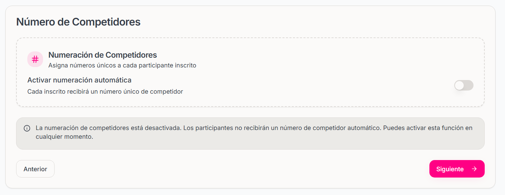
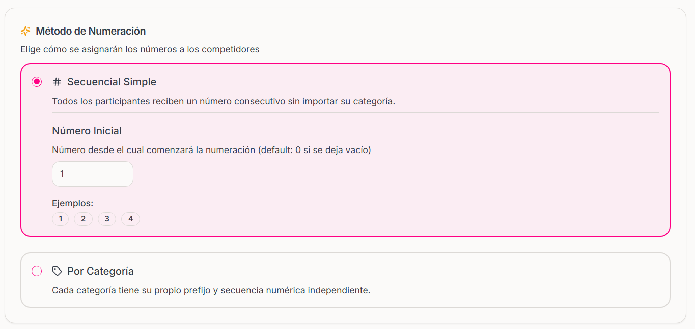
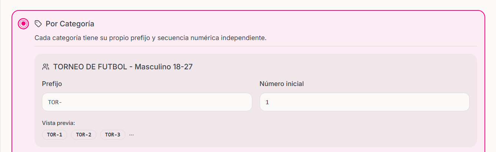

## ¿Qué es la Numeración de Competidores?

La numeración de competidores (también conocidos como dorsales) es un sistema automático que asigna un número único a cada participante inscrito en tu evento. Esto facilita la identificación, control y organización durante el desarrollo del evento.

## Métodos de Numeración Disponibles

### **1. Secuencial Simple**
- **Descripción:** Todos los participantes reciben números consecutivos
- **Ejemplo:** 1, 2, 3, 4, 5...
- **Uso ideal:** Eventos pequeños, carreras populares, torneos simples
- **Ventajas:** Fácil de implementar, sin confusiones

### **2. Por Categoría**
- **Descripción:** Cada categoría tiene su propio prefijo y secuencia
- **Ejemplo:** 
  - VAR-1, VAR-2, VAR-3 (Categoría Varones)
  - DAM-1, DAM-2, DAM-3 (Categoría Damas)
  - MAS-1, MAS-2, MAS-3 (Categoría Master)
- **Uso ideal:** Eventos con múltiples categorías, competencias federadas
- **Ventajas:** Organización por grupos, fácil identificación visual

### **3. Manual (Desactivada)**
- **Descripción:** Sin asignación automática de números
- **Uso ideal:** Eventos que no requieren numeración, inscripciones simples
- **Ventajas:** Flexibilidad total, sin estructura fija

## Configuración de la Numeración

### **Paso 1: Activar la Numeración**

<Frame>
    
</Frame>

**Opciones disponibles:**
- **Activar numeración automática:** Asigna números automáticamente
- **Desactivar:** Los participantes no reciben número automático

<Note>
    Puedes activar o desactivar esta función en cualquier momento, incluso después de creado el evento.
</Note>

### **Paso 2: Elegir el Método**

#### **Opción A: Secuencial Simple**

**Configuración:**
- **Número inicial:** Desde dónde comenzará la secuencia (default: 0)
- **Prefijo:** No aplica (solo números consecutivos)

**Ejemplo de configuración:**
- Número inicial: 100
- Resultado: 100, 101, 102, 103...

<Frame>
    
</Frame>

#### **Opción B: Por Categoría**

**Configuración por categoría:**
- **Prefijo:** 3 caracteres que identifican la categoría (auto-generado)
- **Número inicial:** Secuencia independiente por categoría

**Ejemplos de prefijos automáticos:**
- "Categoría Varones" → VAR-
- "Categoría Damas" → DAM-
- "Master 40+" → MAS-
- "Juvenil" → JUV-

<Frame>
    
</Frame>

<Warning>
    Para usar numeración por categoría, primero debes crear las categorías en el evento en el paso Disciplinas y Categorías.
</Warning>

## Ejemplos Prácticos

### **Carrera 5K Local**

**Configuración recomendada:**
- **Método:** Secuencial Simple
- **Número inicial:** 1
- **Resultado:** 1, 2, 3, 4, 5...

**Por qué funciona:**
- Evento pequeño y simple
- Fácil control en la línea de salida
- Los participantes se identifican rápidamente

### **Maratón con Categorías**

**Configuración recomendada:**
- **Método:** Por Categoría
- **Categorías y prefijos:**
  - Elite Masculino: ELI-
  - Elite Femenino: ELF-
  - Master Masculino: MAS-
  - Master Femenino: MAF-

**Por qué funciona:**
- Fácil identificación por grupos
- Control diferenciado en puntos de control
- Profesionalismo en la presentación

### **Torneo de Natación**

**Configuración recomendada:**
- **Método:** Por Categoría
- **Prefijos personalizados:**
  - Libre: LIB-
  - Espalda: ESP-
  - Pecho: PEC-
  - Mariposa: MAR-

**Por qué funciona:**
- Identificación inmediata del estilo
- Organización por series de competencia
- Control eficiente en piscinas

## Gestión de Números Asignados

Podras gestionar los números y consultar los números asignados en la sección de detalles del evento.