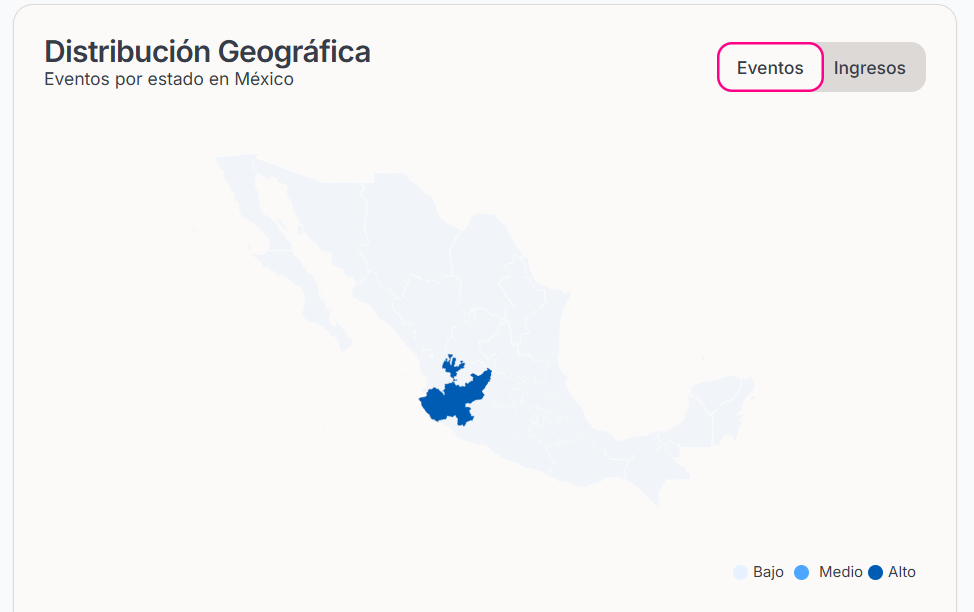
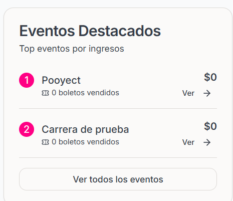

#### Dashboard Financiero

Puedes consultar el Dashboard Financiero para el Análisis de ventas y eventos de tu organización. Dentro del Dashboard puedes consultar una Gráfica de Tendencia de Ventas que te ofrece:

- Exportar los datos a un Excel
- Filtrar los datos por: Ingresos o Boletos
- Presentar los datos en una Gráfica de Línea o una Gráfica de Barras

#### Estadísticas de Eventos 

En este apartado de la sección podrás consultar un resumen de:

- Total de Eventos
- Eventos Publicados
- Eventos Borrador
- Capacidad Total
- Eventos Próximos

#### Distribución Geográfica

En este Mapa podrás consultar el lugar de los Eventos por estado y los ingresos.

    <Frame>
        </img>
    </Frame>

#### Eventos Destacados

En esta sección podrás consultar el Top de eventos por ingresos
    <Frame>
        </img>
    </Frame>

